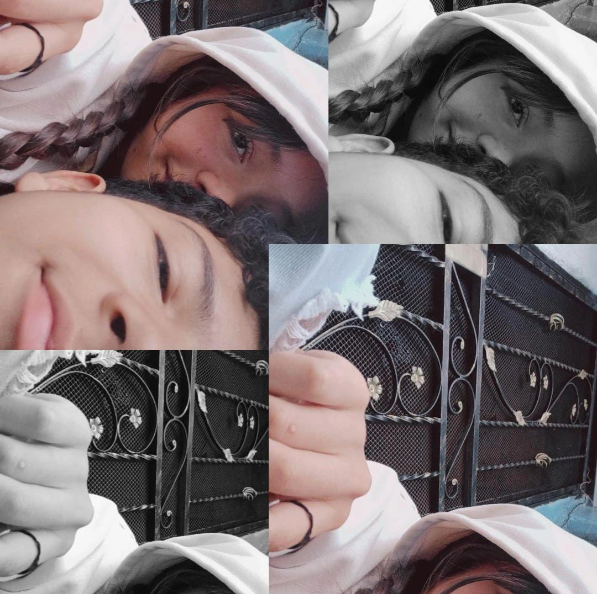
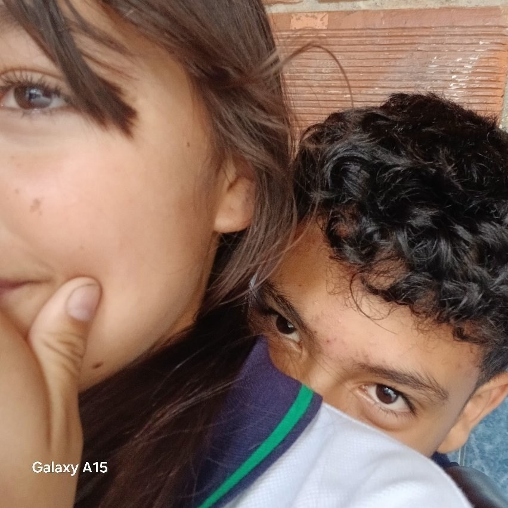

<!DOCTYPE html>
<html lang="es">
<head>
<meta charset="UTF-8">
<meta name="viewport" content="width=device-width, initial-scale=1.0">
<title>Para mi cachetonchita ❤️</title>

</head>

<body>

<!-- Música -->

<audio id="musica" loop preload="auto">
<source src="cancion.mp3" type="audio/mpeg">
</audio>

<!-- Pantalla Inicio -->

<h1 style="font-size:90px;">❤️</h1>

<button onclick="mostrarCarta()">
¿Sabes cuánto te amo?
</button>

<!-- Carta -->

Para mi cachetonchita ✨

Hoy cumplimos 1 año y 3 meses, y la verdad no sé ni por dónde empezar para explicarte todo lo que siento por ti, mi cachetonchita. Desde que llegaste a mi vida, todo ha sido diferente, más bonito, más especial. Eres esa persona que con solo un mensaje o una sonrisa logra cambiar mi día por completo y hacerme sentir feliz incluso en los momentos difíciles.

Me encanta todo de ti, desde las cosas pequeñas hasta las que te hacen única. Me gusta pensar en ti cuando veo unos Takis rojos e imaginarte feliz disfrutándolos. Me encanta saber que te gustan los caballos paso fino, porque siento que tienen esa elegancia y fuerza que también hay en ti. Y hasta algo tan simple como el Tajín me recuerda a ti, porque contigo todo tiene más sabor, más emoción y más vida.

Gracias por estar conmigo, por apoyarme, por entenderme y por compartir tantos momentos a mi lado. Gracias por escucharme, por hacerme reír y por demostrarme cada día que contigo todo vale la pena. No todo es perfecto, pero cuando estoy contigo cualquier problema se siente más pequeño.

Cada día a tu lado me enseña lo mucho que te amo y lo importante que eres para mí. A veces me pongo a pensar en todo lo que hemos vivido juntos durante este año y 3 meses, y sinceramente no cambiaría nada. Cada recuerdo contigo se volvió especial para mí: las conversaciones, las risas, los momentos simples y todas esas pequeñas cosas que hacen que nuestra historia sea tan bonita.

Quiero que sigamos sumando meses, recuerdos y sueños juntos. Quiero seguir abrazándote, seguir haciendo recuerdos contigo y seguir construyendo una historia que nunca termine. Porque si este 1 año y 3 meses ha sido así de especial, no me imagino todo lo hermoso que todavía nos falta por vivir.

Y aunque a veces no encuentre las palabras perfectas para demostrarte todo lo que siento, sí tengo claro algo: eres una de las mejores cosas que me han pasado en la vida y no quiero perderte jamás.

<!-- Fotos -->

Te amo muchísimo ❤️

<button onclick="irVideo()">
¿Lista para vivir los mejores momentos de tu vida conmigo?
</button>

</body>
</html>
